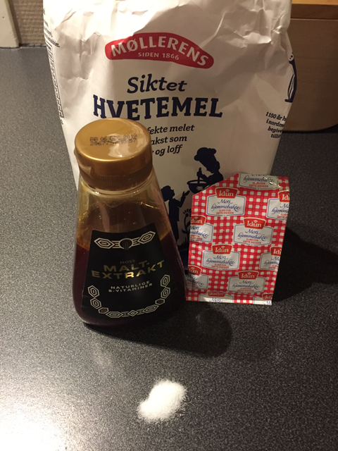
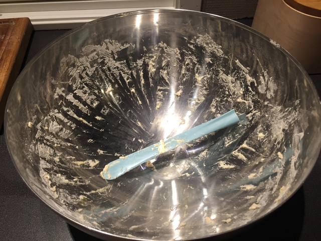
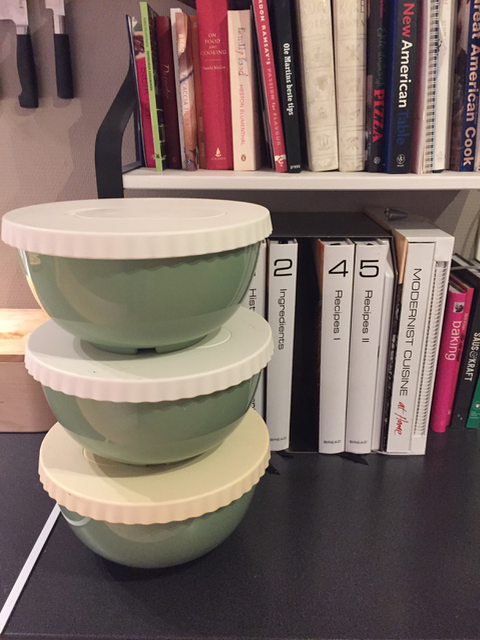
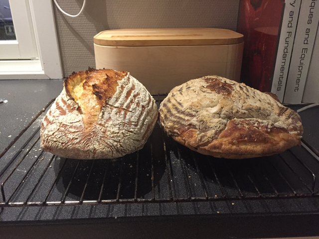
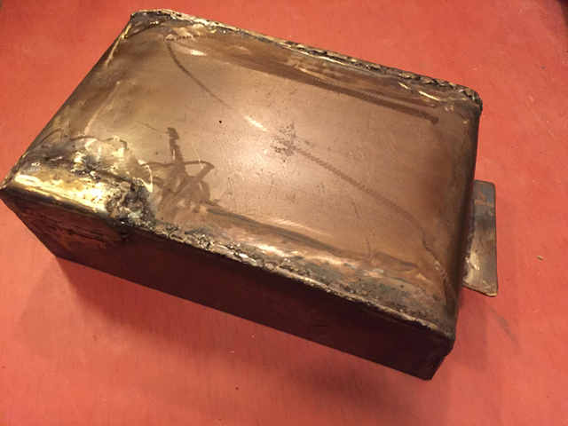
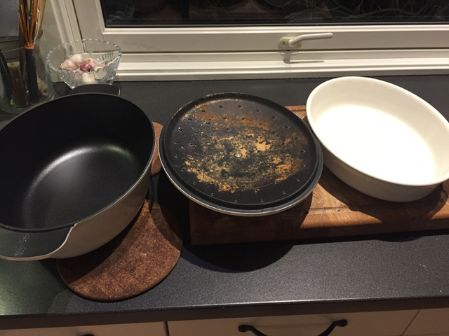
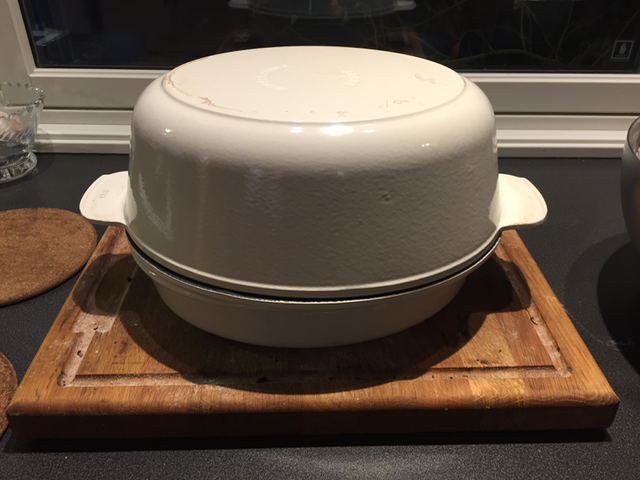
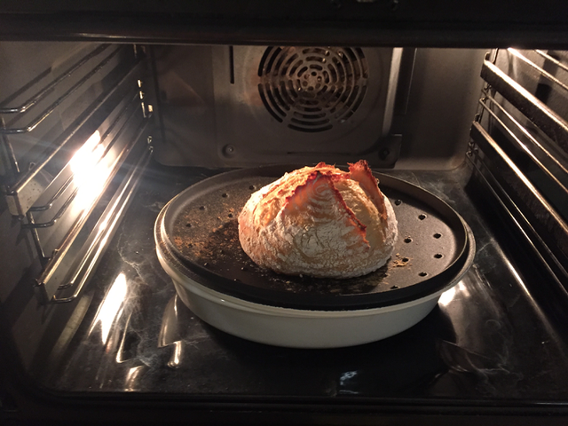
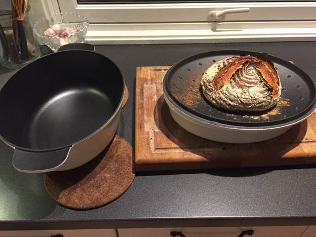
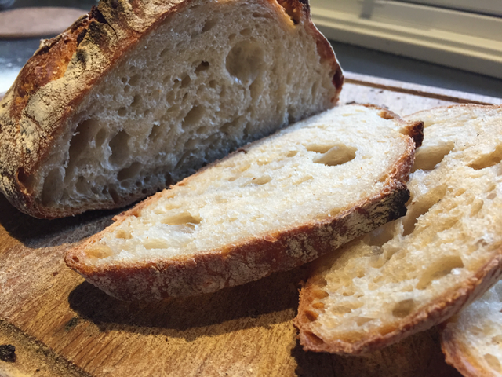

> The ingredients for bread are few, but getting the loaf it right is difficult

Disclamer: I have not figured out all this myself. I've spent hours
reading a really good "book". I highly recommend
[Modernist Bread](http://modernistcuisine.com/books/modernist-bread/) to anyone that are really
serious about baking bread.

## Step 1, mixing the dough

| Amount | Ingredient |
| ------ | ---------- |
| 565 g | Flour |
| 11 g | Salt|
| 1.5 g | Yeast |
| 425 g | Water |
| 10 g  | Malt extract |

This is easy, you just:
- Combine flour, yeast, salt, and maybe some
molasses (gives an extra darkness to the bread). 
- Stir it around to spread the yeast. 
- Add water
- Stir with your hand to get a shaggy mass

I like to use a big steel bowl for this purpose. The IKEA dough knife
works well for cleaning your hand.

But, there is a catch. You have to use good scales to get it right,
especially for the yeast, which requires 0.1 gram accuracy.

## Step 2, bulk fermentation

OK, this is really easy, just leave it overnight. Usually 12 - 18
hours is best, but I often leave it for 20 hours due to convenience.

After bulk fermentation you can store it in the fridge for days. That
way it's easier to bake every day.

## Step 3, proofing
Take it out of the fridge. You need to degas the dough to get it
going again. The
[four way fold](https://www.bakepedia.com/tipsandtricks/the-four-fold-technique-the-key-to-great-homemade-dough/)
works well for this.

You can proof the dough in a
[proofing basket](https://www.clasohlson.com/uk/Bread-Proving-Basket/44-1854). Leave
it for a couple hours. Make sure to keep it covered.

It does matter how long you proof it for though. If proofing time is too long,
then it won't turn out right. The two loafs below are made from the
exact same dough. The only difference is proofing for just 1 hour (left
loaf) versus proofing for 3 hours (right
loaf). 

## Step 4, prepare for baking

This is the most tricky part. Home ovens are not good for
baking. The oven vents the steam, and the dough dries too fast. This
makes a thick crust, and loaf does not rise that well.

A good way to hack the home oven is to enclose the dough in something. 

I searched, but I could not find anything that fit. Since I'm
engineer, I usually think I can do anything. I found some steel
leftovers in my cellar and thought "Maybe I can weld a box?".

After a weekend of welding I had it ready.

But, it turned out that it was difficult to clean. And it also turned out not
to be stainless steel. In addition, I got a bit worried about the origin and
composition of the steel I found in the cellar. I had no idea what type of steel it was, and
whether it contained anything that could be bad (for example lead).

After some thought I decided to abandon the idea. I did improve my
welding skills though, so it was not a complete waste of time.

At IKEA I hit pay-dirt though. A good vessel for baking is
[Senior](https://www.ikea.com/no/no/catalog/products/50232842/),
and combined with
[Vardagen](https://www.ikea.com/no/no/catalog/products/20289316/) it
makes a good baking solution.

## Step 5, scoring
You need to
[score the dough](http://www.thefreshloaf.com/node/31887/scoring-bread-updated-tutorial),
this makes expansion zones so the dough does not burst when it starts to rise.

## Step 6, baking
- Place the lid on top of the Vardagen, put the bottom of the Senior
  on top.
- Heat the baking vessel for an hour in the oven at 245 degrees Celsius

- Transfer the dough to the lid. Bake with the lid on for 20 minutes
- Take the bottom off, bake for another 15 minutes

- Take the it out of the oven when it's done

## Step 7, cooling
Let the loaf cool for a few hours before you cut it. Freezing works
well if you won't consume it within a day.

## Step 8, result
The result was pretty good.

