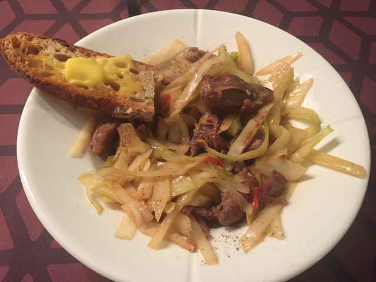

> Quick, spicy dinner

- Cut some lamb, fry in a skillet with some oil.
- Add thinly sliced cabbage
- Add half a chili
- Fry a bit
- Add some water, soy sauce and rice vinegar
- Cook for a while with a lid on
- Cut some bread, add butter and salt

