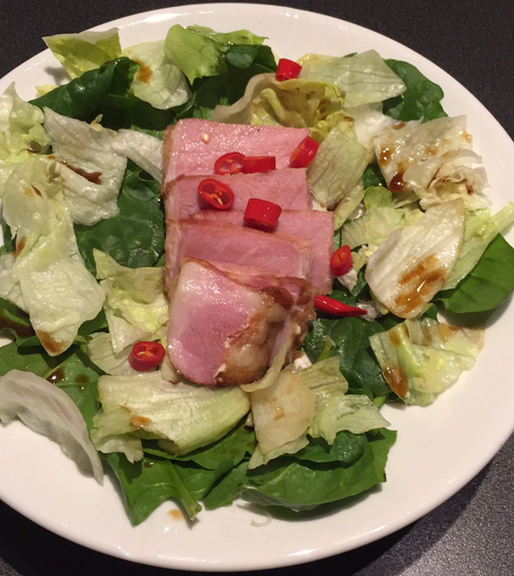

# Coconut Pork

- Pork, 250 gram per person (Røkt Svinekam)
- Chinese garlic
- Chili
- Coconut Milk
- Salt
- Spinach
- Iceberg lettuce 
- Soy sauce

### Step 1: Sous vide 
- Box of coconut milk
- A Chinese garlic (scale according to amount of pork) 
- Pork (for example "Røkt Svinekam" works well)
- One chili (scale according to amount of pork)
- Plastic bag

Set the sous-vide to 60 degrees C. Add all ingredients to a plastic
bag (I use IKEA zip-lock bags). Submerge in the sous-vide setup. Leave
for a few hours. I think I left it for around 3 hours, but the exact
timing is not that important. But you probably need at least 1 hour to
ensure you kill most bacteria's

### Step 2: Make the sauce
- Fry one shallot in a casserole (Shalottløk)
- Add the liquid from the pork sous-vide
- Bring to a boil
- Salt to taste
- Turn down the heat

### Step 3: Rice noodles
- Cook some rice noodles

### Step 4: Pork
- Get a good frying pan, I use a "Le Ceruset" iron skillet
- Turn the heat up high, and add canola oil (raps olje)
- Add the pork when the oil starts to give off smoke
- Fry the pork until it's got color on both sides, this is only a few
  seconds on each side
- Turn the heat down to medium, add butter, and two fattened garlic
  cloves (with the skin)
- Sear until you have a nice color
- Remove and rest for a few minutes

### Step 5: Spinach and Salad
- Wash some spinach and salad
- Dry off as much as possible, I use a
  [salad tosser](https://www.google.no/search?q=salatslynge)
  
## Assembly
- Get some deep dishes
- Add the noodles
- Cover with the sauce
- Sprinkle the salad around the edges
- Pour some drops of Soy sauce on the lettuce and spinach
- Add pork slices
- Add some fresh chili on top

