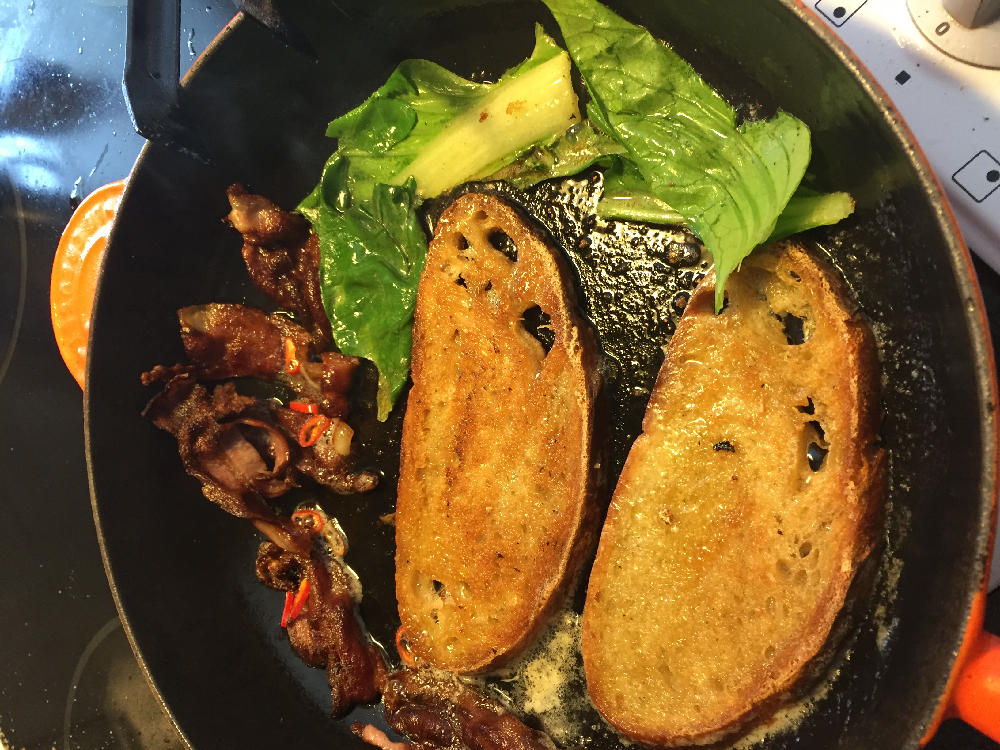
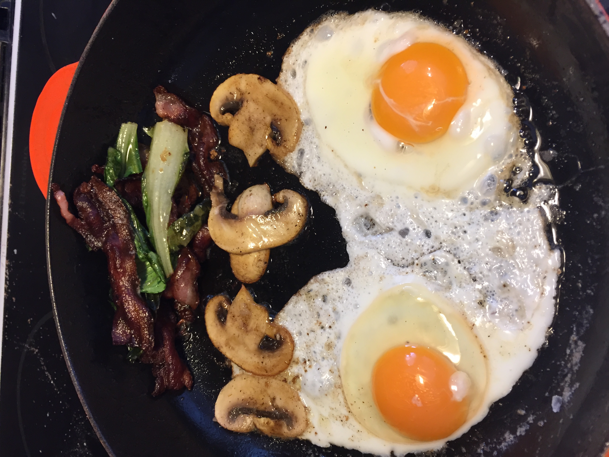
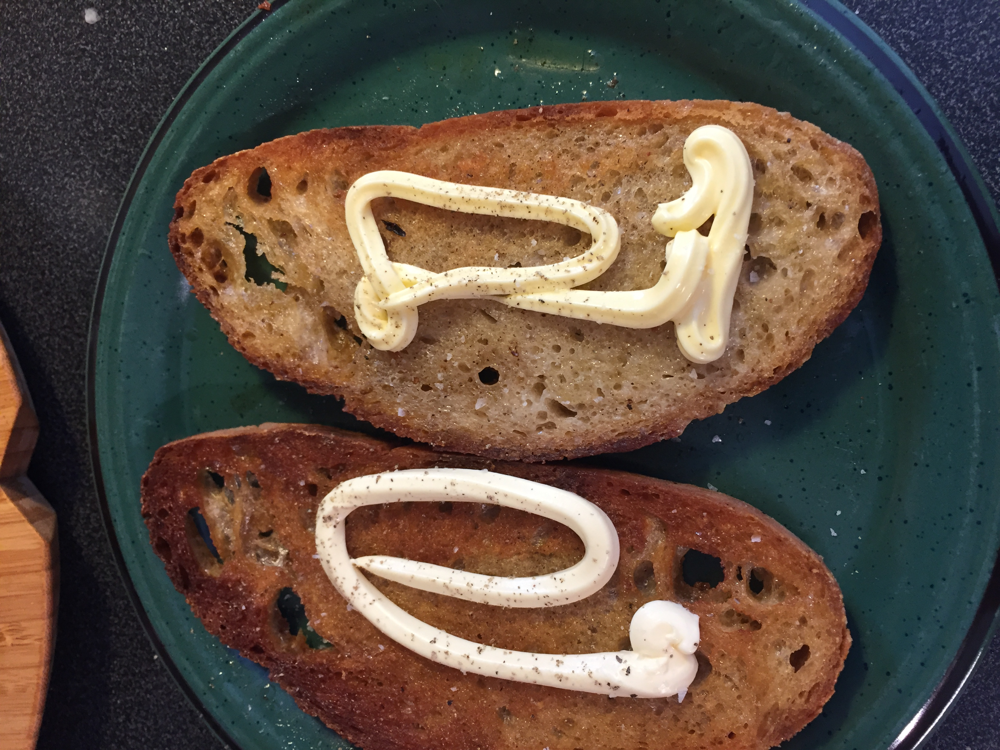
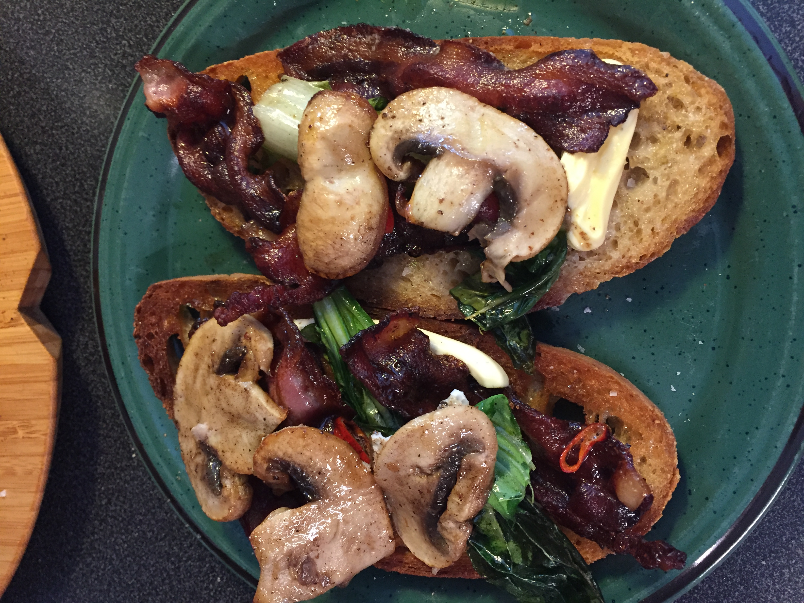
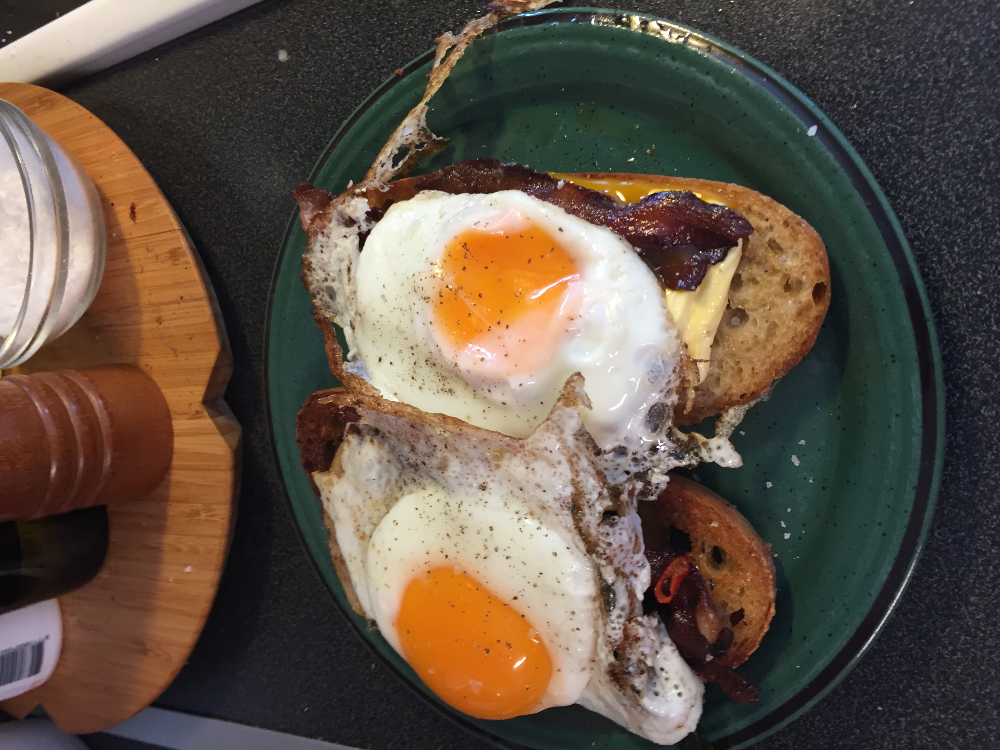

>Perfect meal for lunch. Especially after a run, when you're really
>hungry ;-)

| Amount | Ingredient |
| ------ | ---------- |
| 6 slices | Bacon |
| 2 slices | Homemade bread|
| 1 | bok-choi leaf |
| 1/4 | Chili |
| some | Mayonaise |
| some | Mushroooms |

- Fry the bacon at high temp with some oil
- Reduce the temp, and wait for color to develop
- Add bread to soak up the oil and bacon juices
- Add butter, chili, bok-choi

- Remove bread when done
- Fry mushrooms
- Reduce temperature to low
- Add eggs
- Place a lid on top of the skillet

# Assembly
- Put some mayo on the bread, add salt and pepper

- Add bacon, bok-choi, chili's and mushrooms

- Add eggs

- Pair with apple juice and good coffee

