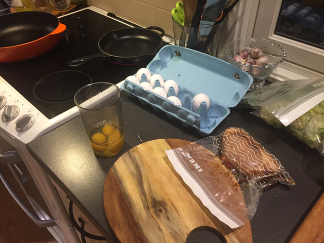
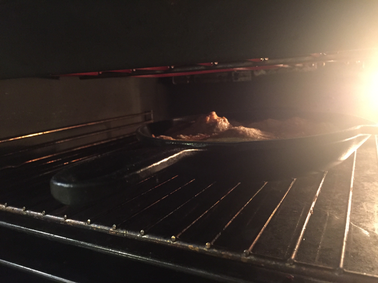

>This was pretty good, some lemon could have made it better. 

| Weight | Ingredient |
| ------ | ---------- |
| 250 g  | Pork (Røkt Svinekam) |
| 1/4 bottle | Ketjap Manis |
| 1 | Chili |
| some | Spinach |
| 3 | eggs |
| some | Salt, Maldon or any other coarse salt |

## Step 1:
- Add pork, Ketjap Manis and chopped chili to a sous-vide bag (or IKEA
zip-lock bag)
- Leave for 1.5 hours at 60 C in a sous-vide setup (I use a
[PID controller](https://www.auberins.com/index.php?main_page=product_info&cPath=13&products_id=330)
and a rice cooker)

## Step 2:
- Add eggs to a container that you can use for a hand blender
- Add the sauce from the sous-vide bag
- Mix properly
- Turn on the grill setting on the oven
- Heat up a small iron skillet to medium heat, add butter
- Add the mixed eggs to the skillet
- Turn the heat down.

## Step 3:
- Dry off the meat with some paper
- Cut of the fat (or leave in if you want)
- Flatten a couple garlic's

## Step 4:
- When the bottom of the omelet starts to solidify move to an
oven with the grill on

## Step 5:
- Add canola (raps) oil to a skillet at high heat. 
- Add the meat and fry until you get some color
- Add butter and garlic
- Take the omelet out of the oven

## Assembly:
- Add some spinach around the edges
- Slice the meat, and place on top
- Add salt and pepper. Some lemon does not hurt.

