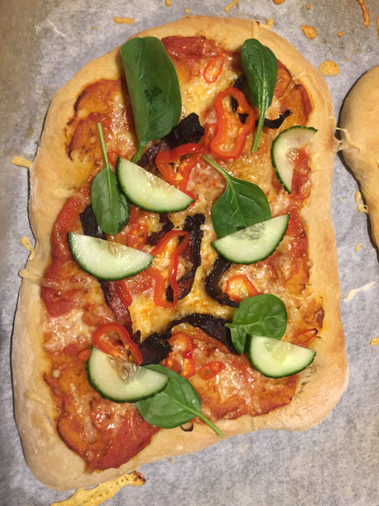

> A good pizza for a normal oven. Requires planning, but assembly is quick.

## Step 1  (up to 5 days before):

| Amount | Ingredient |
| ------ | ---------- |
| 2 | Chinese garlic |
| 1 | onion |
| 2 | carrots |
| 50 g | olive oil |
| 2 boxes | Mutti canned chopped tomato |

- In a pressure cooker, add the chopped garlic, onion, carrots and oil.
- Fry until the onion goes blank
- Add tomato
- Put the lid on the pressure cooker, which should be set for high pressure.
- When max pressure is reached, start a timer for 45 minutes. Make
  sure you turn down the heat.
- Place in sink, and run tepid (lunka) water across one edge of the
  pressure cooker. Do not open until pressure has gone down
- Use a hand blender to turn into a smooth consistency
- Store in "Norgesglass" for up to 5 ish days in the fridge

## Step 2 ( at least 12 hours before):

| Amount | Ingredient |
| ------ | ---------- |
| 565 g | Flour |
| 11 g | Salt|
| 1.5 g | Yeast |
| 425 g | Water |

- Mix flour, salt and yeast in a bowl.
- Add water, and mix to a shaggy mass.
- Cover with plastic
- Leave on the bench for up to 24 hours

## Step 3 ( > 30 minutes before):
- Flatten the dough and divide into 4 equal pieces
- Flatten the pieces into pizzas. 
- Proof (heve) the pizzas for at least 30 ish minutes in a warm place
- Turn on oven at 250 C

## Assembly :
- Put pizzas in oven without topping, and bake for 8 minutes. This
  ensures you won't get a soggy pizza.
- Assemble pizzas with tomato sauce (see above) and toppings of your
  choosing
- Bake for 12 ish minutes until you got the color you want
- Drizzle salt and olive oil on the pizzas after cooking, and cool
  for a bit.

