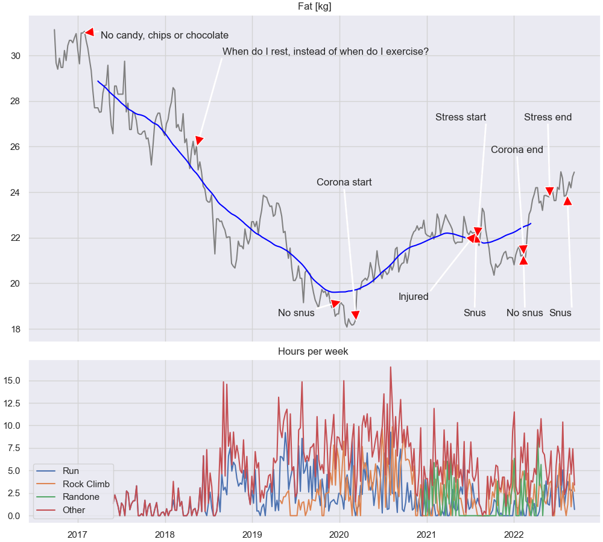

#Weight loss

This is some correlations that I've observed with regards to weight
loss, however, I only have one data point (mine), so the causality is
uncertain. Maybe you'll find it useful, if not, well, no harm done.

## Why
About 2010/2011 I was 122.5 kg, and was likely riding an express
train towards early death. I did not exercise, I ate way to much, and
had in general an unhealthy lifestyle.
Around that time, my son and I visited Thomas Land, as in "Thomas the
Tank Engine" Land, in Birmingham. One night in the hotel I felt chest
pain, likely just a muscle that was acting up, but it made me think.
I was in a foreign country, alone with my son, and if I'd had a fatal
heart attack that night, he would have woken up with a dead dad on the
floor, and being 5 years old, would not know what to do. It was time
to reduce the probability of occurrence. 

## First How - Exercise
I began exercising, first Taekwon-do (after a 10 year break), then running, then running and
bouldering, I tried to eat healthier, and it did help a bit. 5 years
flew by, and the weight dropped to 110 kg. 

I was exercising a few times a week, but that was not sufficient to
keep reducing the weight. Then, in May 2018, my exercise regime changed. Instead of deciding
what days during a week I was going to exercise, it became what days
do I rest. What's really weird, is that after a while, it became easy
to exercise, even a few days without any exercise I felt restless,
and just had to do something.

A few tips if your just starting out exercising:
- Key thing is to avoid injury, if you go to long, or too often, you
  will get injured
- What I did, which worked for me, was basically only focus on heart rate. I
  did a short warm-up, 5 - 10 minutes, to get heart rate up to 75 % of max
  (for me, around 140). Afterwards, I did a short sprint uphill to get it up
  above 85 % heart rate (for me, 161 bpm). Then, I stopped. The whole thing maybe took
  15 minutes, and that was all I did that day. A nice side effect is
  that, apparently, if 
  you get your heart rate high enough, then the blood sugar level stays
  low for about 24 hours [[1]](https://www.ncbi.nlm.nih.gov/pmc/articles/PMC3587394/). And, with this short run it did not really
  stress my muscles that much, so I was able to do it every day.
- As I got stronger, then I could extend the runs, but at the same
  time I reduced intensity. I also discovered that I could, after
  about a few years, run at 65 % intensity (around 124 bpm), and then I
  could go for a long time.
- I would strongly recommend [PAI Health](https://www.paihealth.com) , it's a
  really good tool for measuring if you're doing enough to keep
  healthy. Initially it was a struggle to get 100 PAI. These days, if I'm
  training really hard it climbs up to 250 PAI, but at that intensity
  I can only keep it going for a few weeks. Normally it hovers around
  150 to 200 PAI (sometimes below 100, if I'm having a bad week).
- A good thing to know, if you're in really bad shape, then every time
  you exercise will be extremely hard. Even running, in the
  beginning, was impossible for me without the heart rate climbing past 85 %
  max. So it's really hard to exercise often, because you're screwed
  for a few days after an hours exercise. I would recommend to keep
  the sessions very short. As said before, just get the heart rate up,
  and then stop. 
- It's OK to walk on a run. I still do that if the heart rate climbs
  too high.

## Second How - Nutrition
We all know the adage "calories in versus
calories out" for weight loss. It's probably a bit more complicated
than that, but that does not make it false.

In the old days, I was not any good at the "calories in" part, I ate
everything. Also, pretty much every Friday and Saturday was a 
binge fest (chocolate and chips).
I started noticing, however, that if I binged on a Friday, I felt like crap on
Saturday, so on 2017-01-26 I stopped eating candy, chocolate and
chips. The effect was pretty immediate. Not only did it help on the
weight, but I had more energy. Over the last years I've tried dropping
different foods (bread, pasta, meat) to the point where at one point I was
basically living on whole greens, nuts, eggs, sometimes fish. The
funny thing, is that it was quite easy to maintain that diet, mostly because every
time I try eating a pizza I feel like crap for a few days, basically
like a hangover, which makes it easier to avoid things that seems bad
for me, I simply don't want to eat them anymore.

I lived on that strict diet from 2019-11-14 to 2020-05-26, but it
got too restrictive, and boring. These days I'm back to eating mosts things.

## Third how - Consistency
The only way to make lasting changes to the weight, is to make lasting
changes to the calorie intake, and calorie expenditure. So don't expect
to change your weight quickly, you have to commit for the long
run. I've had to get comfortable with that I probably never again (as
in ever), can binge on candy, chocolate and chips, but that's OK. I
don't really want to anymore.

## Results
I'm not done yet, but it would be fun to see if I can actually reach a
normal BMI. For me that would be 84 kg, which would be 38.5 kg
down from max. 84 kg seems pretty far away still, but not impossible.

Below you can see my weight over the last three years. The blue curve is
an estimate of the weight without the seasonal variation (Christmas is
really an enemy of weight control). Also, on 2020-01-10 I removed nicotine
intake (snus), which I believe is one of the reasons the weight jumped a bit again. That, and
corona of-course.

## PS1: It ain't a solo adventure
I've been motivated by different things over the last years, here's a few people that have
really helped me out.
- AE: He showed me the route up to "Solheimsvåttan", a local hill, that I really
  fell in love with. It was perfect, I could not run up (it's 400
  meters up hill), but I could walk, and that got the heart rate up.
- DEL: After the summer of 2018 he came up with the idea to have a
  running competition, basically "Let's see who can run the furthest
  until the snow comes". We were three persons at work that joined, and
  that really made it easier to get up early, and go for a
  run. Competition helps.
- TA: For being the one crazy enough to join me on the "Oppdal
  Fjellmaraton" 2019. A really good day.
- OD: Pushed me to join "Top 10" in Trondheim 2018. A 32 km race, and over
  1000 meters altitude. After completing that I fell in love with
  running far in the mountains.
- IB: For showing me bouldering technique, and being a fantastic climbing
  buddy. So, many fun hours (and many more to come).
- PH: For pushing me way beyond my limits on our regular "training camps".
- My sister: I think my sister got motivated by my progress, and she
  also fell in love with running. That's really cool. The fact that my
  journey has motivated others is really motivating for me.

## PS2: Programming
I love programming, everytime I go on holiday, then after a few days
rest, I end up programming something. In my
[health](https://github.com/wulffern/health/tree/master/fitbit) repo
you can find the code  to parse the
[Fitbit Aria](https://www.fitbit.com/aria2) data.

