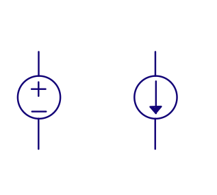
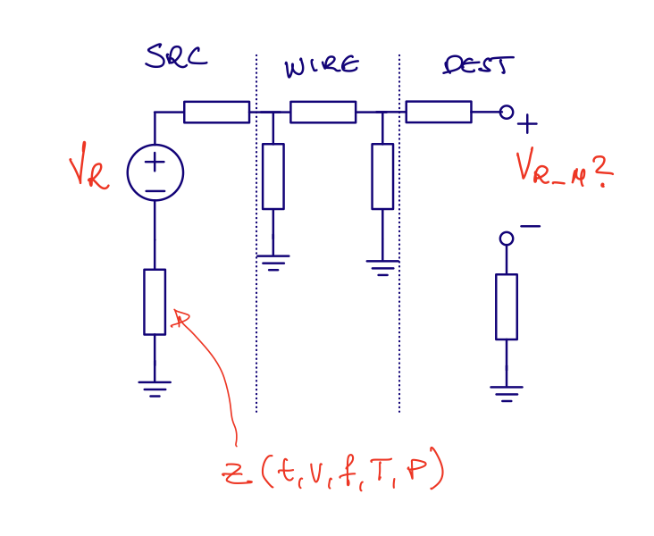
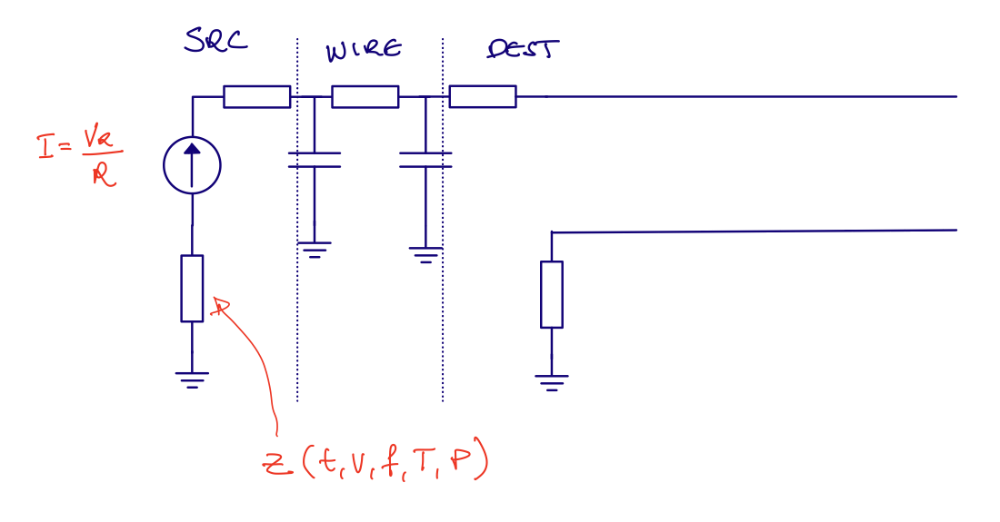

In our testbenches, and trial schematics, it's common to include voltage sources and current sources. However, the 
ideal voltage source, or ideal current source does not exist in the real world. There is no such thing.

We can come close to creating a voltage source, so a known voltage, with a  low source impedance, but it won't be zero.
And it won't be infinetly fast either. If we suddenly decide to pull 1 kA from a lab supply I promise you the voltage will drop. 

So how do we create something that is a _good enough_ voltage and current source on an IC?

### Routing

Before we take a take a look at the voltage and current source, I want you to think about how you would route a current, or a voltage on an IC.

Assume we do have a known voltage on our IC. How can we make sure we can share that voltage across an IC? 

A voltage is only defined between two points. There is no such thing as the _voltage at a point on a wire_, nor _voltage in a node_. 
Yes, I know we say that, but it's not right. What we forget is that by _voltage in a node_ we always, always mean _voltage in a node referred to ground_.

We've invented this magical place called _ground_, the final restingplace of all electroncs, and we have agreed that all voltages refer to that point.

So when we say "Voltage in node A is 1V", what we actually mean is "Voltage in node A is 1 V referred to ground".

Now you understand why we can't just route a known voltage across the IC, the other side might not have the same ground. The _other_ side
might have a different impedance to ground, and the impedance might be a function of time, voltage, frequency temperature, pressure and presence of gremlins.

</img> 

Most of the time, in order not to think about the ground impedance, we choose to route a known quantity as a current instead of a voltage. That means, however
, we must convert from a voltage to a current, but we can do that with a resistor (you'll see later), and as long as the resistor is the same on the other side of the IC, 
then we'll know what the voltage is.

</img> 

##  Bandgap voltage reference

A bipolar transitor, or indeed a PN diode, assuming a fixed current, will have a voltage across that is temperature dependent

$$I_D = I_S (e^{V_D/V_T} - 1)$$
As $I_S$ is much smaller that $I_D$ we can ignore the -1, which gives us 

$$V_D = V_T ln{\frac{I_D}{I_S}}$$
From this equation, it looks like the voltage $V_D$ is proportional to temperature, as

$$V_T = \frac{k T}{q}$$
However, it turns out that the $V_D$ usually decreses with temperature due to the temperature dependence of $I_S$ . If you want to understand why, you need to read up on the semiconductor physics, and how [Shockley diode equation](https://en.wikipedia.org/wiki/Shockley_diode_equation) was derived.

The $V_D$ is linear with temperature with a property that if you extraplotate the V_D line to zero Kelvin, then they all seem to meet at the bandgap voltage of silicon (approx 1.2x V). 

</img> 

If we take two diodes, or bipolars, biased at different current densities, for example

$$V_{D1} = V_T \ln{\frac{I_{D1}}{I_S}}$$
$$V_{D2} = V_T \ln{\frac{I_{D2}}{I_S}}$$
where $I_{D1} = 8 I_{D2}$, then

$$V_{D1} - V_{D2} = V_T \ln{\frac{I_{D1}}{I_S}} - V_T \ln{\frac{I_{D2}}{I_S}} = V_T \ln{\frac{I_{D1}}{I_{D2}} }  = V_T \ln 8$$
This is a remarkable result. The difference between two voltages is only defined by boltzmann's constant, temperature, charge, and a know current relationship.

This differential voltage can be used to read out directly the temperature on an IC, provided we have a known voltage to compare with. 

We often call this voltage $\Delta V_D$ or $\Delta V_{BE}$, and we can clearly see it's proportional to absolute temperature. 

We know that the $V_D$ decreases linearly with temperature, so if we combined a multiplum of the $\Delta V_{BE}$ with a $V_D$ voltage, then we should get a constant voltage.

The Brokwaw reference below does exactly that. The opamp ensures the two bipolars have the same current. $Q_1$ is larger than $Q_2$. 
The $\Delta V_{BE}$ is across the $R_2$, so we know the current $I$. We know that $R_1$ must then have $2I$. The voltage at the output will then be.

$$V_{BG} = V_{G0} + (m-1)\frac{kT}{q}\ln{\frac{T_0}{T}} +T\left[\frac{k}{q}\ln{\frac{J_2}{J_1}}\frac{2R2}{R1} - \frac{V_{G0}- V_{be0}}{T_0}\right]$$
where $V_{G0}$ is the bandgap, $V_{be0}$ is the base emitter measured at a temperature $T_0$ and the $J$'s are the current densities.

To get a constant output voltage, the relationship between the resistors should be approximately

$$\frac{R2}{R1} = \frac{V_{G0} - V_{be0}}{2 T_0 \frac{k}{q}\ln(\frac{J_2}{J_1})}$$
</img> 

If you have access to SUN_BIAS_GF130N, then you can check the go program that was used to calculate the resistor relationship. The value was slightly tweaked in the design to get the desired output 
output voltage.

`sun/sun_bias_gf130n/go/`

</img> 

`sun/sun_bias_gf130n/design/SUN_BIAS_GF130N/SUN_BIAS_CORE`

</img> 

In typical simulations, the variation is extremely low over the temperature range. The second order error is the remaining error from

$$V_{BG} = V_{G0} + (m-1)\frac{kT}{q}\ln{\frac{T_0}{T}} +T\left[\frac{k}{q}\ln{\frac{J_2}{J_1}}\frac{2R2}{R1} - \frac{V_{G0}- V_{be0}}{T_0}\right]$$
Where the last term is zero, so 

$$V_{BG} = V_{G0} + (m-1)\frac{kT}{q}\ln{\frac{T_0}{T}}$$

</img> 

Over corners, I do expect that there is variation. It may be that the $V_D$ modeling is not perfect, which means the cancellation of the last term is incomplete. 

We could include trimming of $R_1$ to calibrate for the remaining error, however, if we wanted to remove the linear gradient, we would need a two point temperature test of every
IC, which too expensive for low-cost devices.

</img> 

With a known voltage, we can convert to a known current with the circuit below. On-chip we don't have accurate resistors, but for bias currents, it's usually ok with $+- 20 %$ variation 
(the variation of R). 

Across a IC, we can expect to match the R within a few percent, so we can recreate a voltage with a accuracy of a few percent difference from the original.

If we wanted to create an accurate current, then we'd trim the R until the current is what we want. 

</img> 

##  Low voltage bandgap

The Brokwaw reference, and others, have a 1.2 V output voltage, which is hard if your supply is below about 1.4 V. As such, people have investigated making lower voltage references.

In real ICs though, you should ask yourself long and hard whether you really need these low-voltage references. Most ICs today still have a high voltage, either 1.8 V or 3.0 V. 

If you do need them though, consider the circuit below. We have two diodes at different current densities. The $\Delta V_D$ will be across $R_1$. The voltage at the input of the OTA will be $V_D$ 
and the OTA will ensure the both are equal. 

The current will then be 

$$I_1 = \frac{\Delta V_{D}}{R_1}$$
and we know the current increases with temperature, since $\Delta V_D$ increases with temperature.

</img> 

In the figure below I've used $\Delta V_{BE}$, it's the same as $\Delta V_{D}$, so ignore that error.

Assume we copy the $V_D$ to another node, and place it across a second resistor $R_2$, as shown in the figure below.
The current in this second resistor is then 

$$I_2 = \frac{V_D}{R_2}$$
and we know the current decreases with temperature, since $V_D$ decreases with temperature.

</img> 

Let's remove the OTA, and connect $R_2$ directly to $V_D$ nodes, you should convince yourself of the fact that this does not change $I_1$ at all. It does, however, change the current in the PMOS.

Provided we scale $R_2$ correctly, then the positive $I_1$ can be compensated by the negative $I_2$, and we have a current that is independent of temperature. 

$$I_{PMOS} = \frac{V_D}{R_2} + \frac{\Delta V_D}{R_1}$$

</img> 

Assuming we copy the current into another resistor $R_3$, as shown below, we can get a voltage that is 

$$V_{OUT} = R_3\left[\frac{V_D}{R_2} + \frac{\Delta V_D}{R_1}\right]$$

Where the output voltage can be choosen freely, and indeed be lower than 1.2 V.

</img> 

## Bias current

Sometimes we don't need a full bandgap reference. In those cases, we can use a GM cell as shown below, where the impedance could be a resistor, in which case

$$V_o = V_{GS1}  - V_{GS2}  = V_{eff1} + V_{tn} - V_{eff2} - V_{tn} = V_{eff1} - V_{eff2}$$
Assuming strong inversion, then 

$$I_{D1} = \frac{1}{2} \mu_n C_{ox} \frac{W_1}{L_1} V_{eff1}^2$$

$$I_{D2} = \frac{1}{2} \mu_n C_{ox} 4 \frac{W_1}{L_1} V_{eff2}^2$$

$$I_{D1} = I_{D2}$$
$$\frac{1}{2} \mu_n C_{ox} \frac{W_1}{L_1} V_{eff1}^2 = \frac{1}{2} \mu_n C_{ox} 4 \frac{W_1}{L_1} V_{eff2}^2$$
$$V_{eff1} = 2 V_{eff2}$$
Inserted into above

$$V_o = V_{eff1} - \frac{1}{2} V_{eff1} = \frac{1}{2}V_{eff1}$$
Still assuming stron inversion, such that

$$g_{m} = \frac{2 I_d}{V_{eff}}$$
we find that

$$I = \frac{1}{2} V_{eff1} Z$$
$$Z \Rightarrow \frac{1}{g_m}$$
We can use a resistor for Z, or indeed we could use other things.

</img> 

Like a switched capacitor

</img> 

For bias circuits, it's common to have stable state if no current flows, as such, we usually include some form of startup circuit to get them going. A full bias circuit can be seen below.

</img> 

